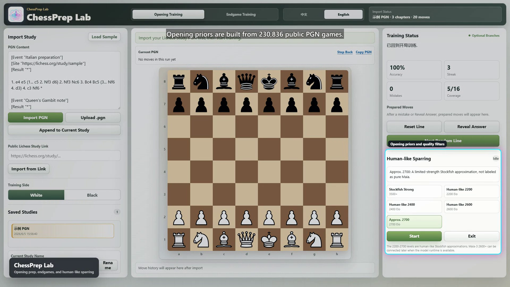
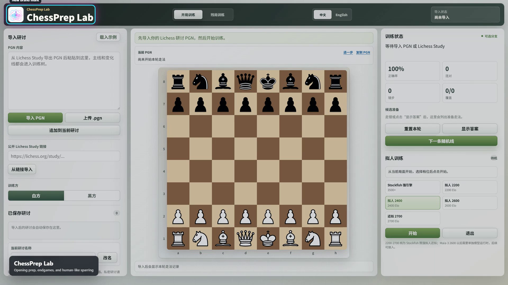
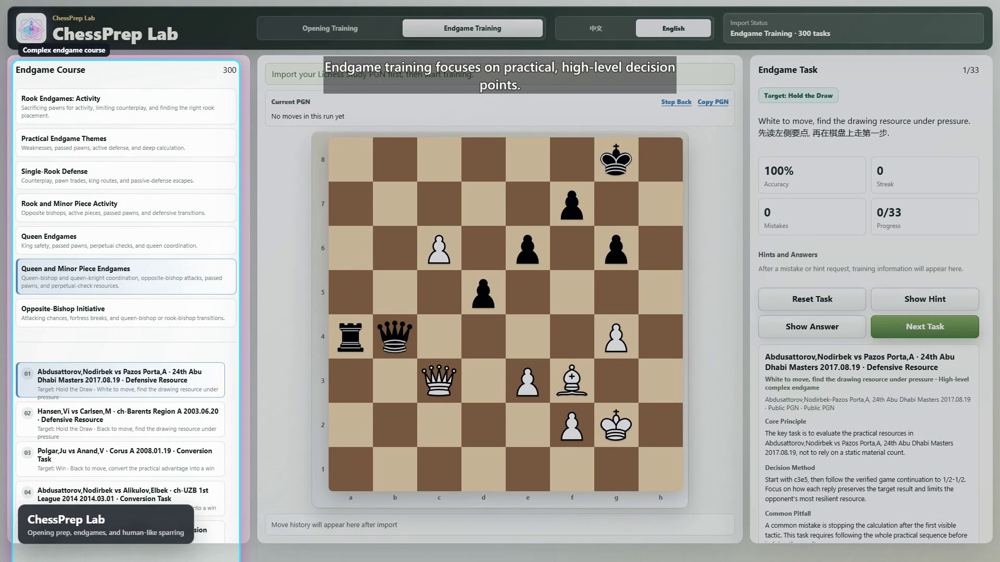

<p align="center">
  
</p>

<h1 align="center">ChessPrep Lab</h1>

<p align="center">
  <strong>本地优先的国际象棋备战、开局记忆、残局训练和拟人对练工作台。</strong><br>
  <strong>A local-first chess preparation workspace for opening recall, opponent prep, endgame training, and human-like sparring.</strong>
</p>

<p align="center">
  <a href="#zh">中文</a> ·
  <a href="#en">English</a> ·
  <a href="docs/media/chessprep-lab-demo.mp4">Demo Video</a>
</p>

<p align="center">
  <a href="docs/media/chessprep-lab-demo.mp4">
    
  </a>
  <br>
  <sub>Click the image to watch the generated demo video.</sub>
</p>

| Opening trainer | Endgame trainer | Prep workspace |
| --- | --- | --- |
|  |  |  |

## <a id="zh"></a>中文介绍

ChessPrep Lab 是一个本地运行的国际象棋训练工作台，用来把 Lichess Study、个人开局准备、对手历史对局、复杂残局和引擎对练放在同一个界面里。它默认只监听 `127.0.0.1`，不要求 Lichess token，也不保存登录信息。

### 核心功能

- **开局训练**：导入 Lichess Study PGN 后，系统把主线和变化树解析成可训练的准备库。你必须在棋盘上走出自己的准备着法，系统会按 PGN 变化树自动选择对手回应；走错时会提示当前位置的候选准备。
- **备战检索**：离线检索对手历史对局，生成对手常走分支、样本数、胜率、和局率和得分率，再和你的准备库对照，帮助你优先补最可能遇到的线路。
- **残局训练**：课程来自高水平实战局面，不是随机题库。每题从真实 FEN 开始，要求沿着可验证主线完成赢棋或守和目标。
- **拟人训练 / 引擎训练**：从准备局面继续下，使用 Stockfish 或 Maia-3 23M 候选走法加 Stockfish 过滤，训练离开准备后的实战处理。
- **双语界面**：应用界面支持中文和英文切换，适合本地自用、教学演示和小范围分享。

### 快速启动

在仓库根目录运行：

```powershell
$env:PORT=8788; node server.mjs
```

然后打开：

```text
http://localhost:8788
```

如果 `8788` 被占用，可以换一个端口：

```powershell
$env:PORT=8790; node server.mjs
```

### 数据规模

备战模式使用本机离线对局库做检索分析。当前开发机上的数据库状态：

- 可检索对局：`2,706,692` 盘。
- 已扫描数据源：`809` 个 PGN 源文件。
- 已导入数据源：`808` 个。
- 去重识别：`59,719` 盘重复对局。
- 离线库体积：约 `1.15GB`。
- 更新时间：`2026-06-09T15:45:56.767Z`。

这些大数据文件不直接提交到 Git；仓库保留核心源码、测试、构建脚本、图标、棋子资源和小型运行索引。

### 隐私与导入

私密研讨请从 Lichess 导出 PGN 后粘贴或上传。公开研讨可以粘贴 `https://lichess.org/study/...` 链接导入；链接导入需要通过 `node server.mjs` 启动，因为浏览器直接从 `localhost` 请求 Lichess 可能被跨域限制挡住。本地服务器只代理公开 PGN，不保存内容。

## <a id="en"></a>English Overview

ChessPrep Lab is a local chess preparation workspace that brings Lichess Study imports, opening recall, opponent preparation, practical endgame courses, and engine sparring into one browser-based app. By default it listens only on `127.0.0.1`; it does not require a Lichess token and does not store login credentials.

### What It Does

- **Opening trainer**: import a Lichess Study PGN and turn the main lines and variations into a playable training tree. You make your prep moves on the board; the app chooses opponent replies from the PGN tree and shows candidate prep moves when you miss.
- **Opponent preparation**: search an offline game database, build an opponent opening tree, and compare the opponent's most common branches against your own preparation.
- **Endgame trainer**: train from real high-level game positions with verifiable solution lines, focused on practical conversion and defensive technique rather than one-move tactics.
- **Human-like sparring**: continue from a prepared position against Stockfish or Maia-3 23M candidate moves filtered by Stockfish, so the training stays human-shaped without allowing obvious blunders.
- **Bilingual interface**: the app UI supports Chinese and English for local training, teaching, and small-group demos.

### Quick Start

Run this from the repository root:

```powershell
$env:PORT=8788; node server.mjs
```

Then open:

```text
http://localhost:8788
```

If port `8788` is already in use:

```powershell
$env:PORT=8790; node server.mjs
```

### Local Data

Opponent prep uses a local offline game database. On the current development machine:

- Searchable games: `2,706,692`.
- Scanned PGN sources: `809`.
- Imported PGN sources: `808`.
- Duplicate games detected: `59,719`.
- Offline database size: about `1.15GB`.
- Last update: `2026-06-09T15:45:56.767Z`.

Large generated datasets are intentionally not committed. The repository keeps the source code, tests, build scripts, icons, chess pieces, and small runtime indexes needed to rebuild or reconnect those local payloads.

### Privacy And Importing

For private studies, export PGN from Lichess and paste or upload it locally. Public studies can be imported from `https://lichess.org/study/...` links when the local Node server is running. The server only proxies public PGN content and does not persist imported studies.

## Repository Notes

The repository tracks the core app and documentation media. The following generated or downloaded payloads stay local and are ignored:

- `data/player-prep/offline-games*`
- `data/player-prep/opening-trees/`
- `data/endgame-expansion/sources/raw/`
- `data/engine-calibration/*.json`
- `installer/package/`, `installer/package-release/`
- `engines/stockfish*`, `engines/maia3/.conda/`, `engines/maia3/hf-cache/`

`data/player-prep/chinese-player-pinyin.json` remains tracked because it is a small index used by prep search.

## Tests

Run the core parser and trainer tests with:

```powershell
node --test tests\server.test.mjs tests\trainer-core.test.mjs
```
